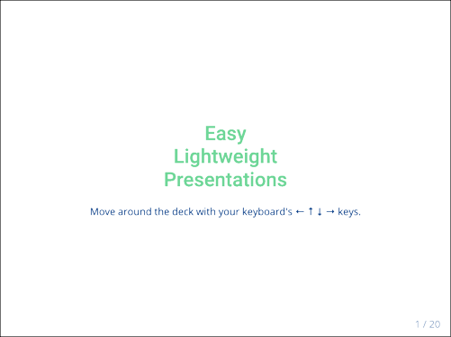

# Presention Deck / Slideshow Creation

An integral part of software engineering development is presenting your ideas and solutions (typically in a conference with some remote participants).

## Common barriers to entry

Generally presentation deck / slideshow creation technologies suffer from some significant barriers to use:

* Expensive &#8212; [PowerPoint](https://products.office.com/en-us/powerpoint)
* Proprietary, non-standard, unsupported &#8212; third-party
* Heavyweight &#8212; results a big binary blobs
* Complicated, non-intuitive technique &#8212; infrequent use, hard to remember
* Platform-dependent results (`PPTX`) &#8212; requires specific viewing software
* Don't integrate well with engineering workflow &#8212; [Google Slides](https://www.google.com/slides/about/)

## My functional wish-list

* Cost &#8212; Free
* Usage &#8212; Quick and simple to use
* Results &#8212; Lightweight, Standalone, and Portable
* Integration &#8212; Seamless with engineering workflow
* Presenter sharing mode &#8212; For teleconferences

## My chosen solution

* Creation &#8212; Favorite text editor
* Formatting &#8212; Standard [Markdown](https://daringfireball.net/projects/markdown)
* Viewing &#8212; Any modern web browser
* Dependencies &#8212; Open-source, stand-alone [remark.js](https://github.com/gnab/remark) package
* Use existing [git](git-scm.com) source code management versioning workflow

## Have your own deck up in 2 minutes!

1. Download [this all-in-one HTML](./slideshow-slideshow.html) file
1. Open in your favorite text editor
1. Edit the existing content to your needs
1. Load in web browser to display, and
	* use `'c'` to clone window to share
	* use `'p'` to enter presentation mode
1. `git commit` presentation when finished
1. Schedule a meeting &#128578;
